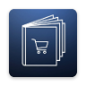

# Products App

A React Native product catalog application built with TypeScript that fetches data from the DummyJSON API. Features: product browsing with filtering by category, sorting by price/rating, and detailed product views.

## Prerequisites

- Node.js (v18 or higher)
- yarn
- React Native development environment [setup](https://reactnative.dev/docs/0.80/set-up-your-environment)

## Setup Instructions

### 1. Clone the repository

```bash
git clone git@github.com:ViniciusSantosFS/products-catalog-app.git
cd productsApp
```

### 2. Install dependencies

```bash
yarn
```

### 3. iOS Setup

Install CocoaPods dependencies:

```bash
cd ios/ && pod install && cd ..
```

### 4. Environment Configuration

Create a `.env` file in the project root.

```bash
cp .env.sample .env
```

## Running the App

### Start Metro

```bash
yarn start
```

### Run on iOS

```bash
yarn ios
```

### Run on Android

```bash
yarn android
```

## Development

### Testing

```bash
# Run all tests
yarn test

# Run tests in watch mode
yarn test:watch

# Run lint
yarn lint
```

## Architecture

This project follows **Clean Architecture** principles with clear separation of concerns:

- **Domain Layer**: Business logic and entities
- **Data Layer**: Use case implementations, domain data mappers
- **Infrastructure Layer**: External frameworks
- **Presentation Layer**: UI components, screens and hooks
- **Main Layer**: Composition root and dependency injection

## Project Structure

```
src/
    domain/          # Core Business layer
    data/            # Data access layer
    infra/           # External frameworks
    presentation/    # UI layer
    main/            # Composition root
```
